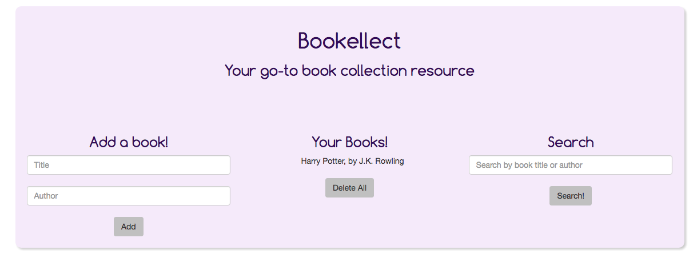

# Book Collection

#### _A book collection website using MySQL, September 19, 2016_

#### By _**Katy Henning & Aimen Khakwani**_

## Description

This is a book collection site. It takes user input and adds books to your collection, storing them using MySQL. Users can also search the list by book title and delete the collection.

## Setup/Installation Requirements

* Clone the repository
* Using the command line, navigate to the project's root directory
* Install dependencies by running $ composer install
* Navigate to the /web directory and start a local server with $ php -S localhost:8000
* Open a browser and go to the address http://localhost:8000 to view the application

## Known Bugs

There are no known bugs at this time.

## Support and Contact Details

For questions or comments, please contact us through GitHub.

## Technologies Used

* _PHP_
* _Silex_
* _Twig_
* _Bootstrap_
* _MySQL_

### License

*This website is licensed under the MIT license.*  
Copyright (c) 2016 **_Katy Henning & Aimen Khakwani_**
